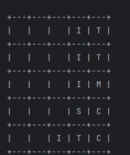
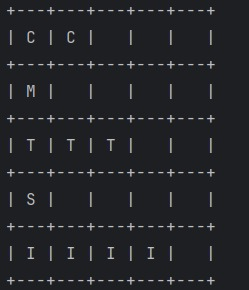
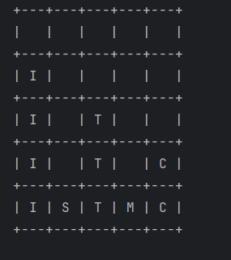
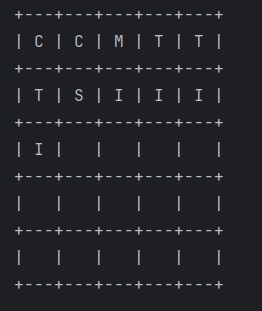

# MarchLegion

## Project Overview

This project implements different **sorting algorithms** and **design patterns** to simulate the organization and management of troops in a battlefield context.  
The system allows sorting, validating, and placing different troop types on a board, while also applying design principles like **Strategy** and **Singleton**.

## Code Functionality

The main focus of this project is to experiment with classic sorting algorithms such as:

- **Bubble Sort**
- **Insertion Sort**
- **Merge Sort**

Each algorithm is implemented as a separate class and can be selected dynamically through a factory and strategy-based design.

### Required Parameters

When running the project, you can pass specific parameters to control its behavior:

- `a`: The algorithm to be used (BubbleSort, InsertionSort, MergeSort).
- `u`: The list of troop units to be sorted, separated by commas. Example: `u=1,2,3,2,5`
- `t-n`: *(Optional)* Can specify data type or board size depending on context.

**Example of usage:**
```bash
a=i t-n u=1,2,3,2,5
```
This will sort the array [1,2,3,2,5] using Insertion Sort.

**Requirements**

Java 17 or higher.

IntelliJ IDEA (recommended).

Clone the repository: 
git clone https://gitlab.com/monicaescobar/marchlegion.git 
cd marchlegion
Compile and run the Main class.

**How It Works**

The user specifies input data (troops, algorithm, orientation, etc.).

The program validates the data and executes the selected algorithm.

Troops are placed and displayed according to orientation and sorting.

The result is printed on the board structure.

**Tests**









**Project Structure**

The project is organized into multiple packages, each with a clear responsibility:

***algorithm***
-BubbleSort
-InsertionSort
-MergeSort
-Algorithm (enum)
-ChooseAlgorithm (interface)

***app***
-Legion
-ManageCLIArgs

***Board***
- ManageArguments
- ManageBoard

***DesignPattern***
-TimeSingleton

****factories****
-AlgorithmFactory

***Orientation***
-StrategyOrientation (interface)
-Orientation (enum)
-BoardStructure
-ManageOrientation

***TroopsType***

****TroopsUnit****
-Troop (abstract class)
-Commander
-Infantry
-Medic
-Sniper
-Tank

***utilities***
-AlgorithmValidator
-BoardValidator
-FieldSizeValidator
-OrientationValidator
-Printer
-TimeValidator
-TroopValidator

Future Implementations

Add more sorting algorithms (QuickSort, HeapSort).

